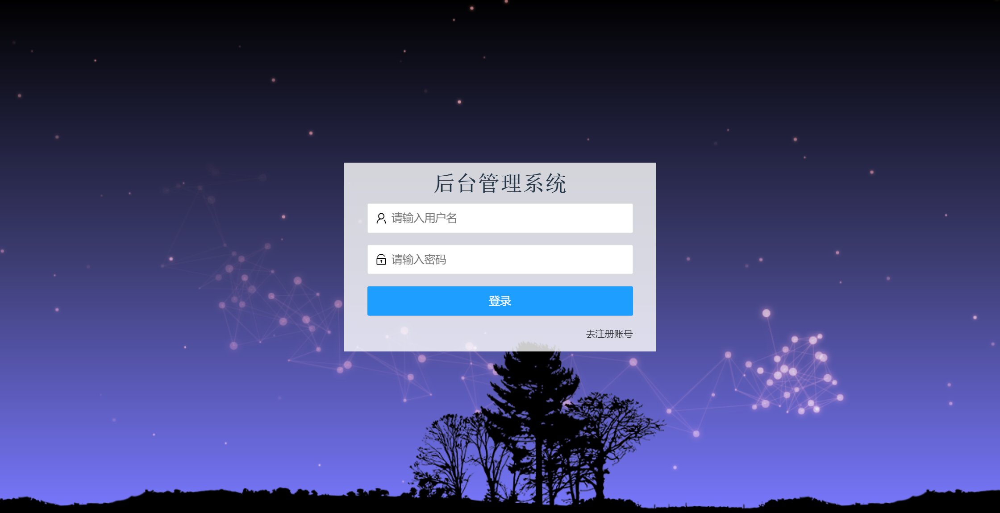
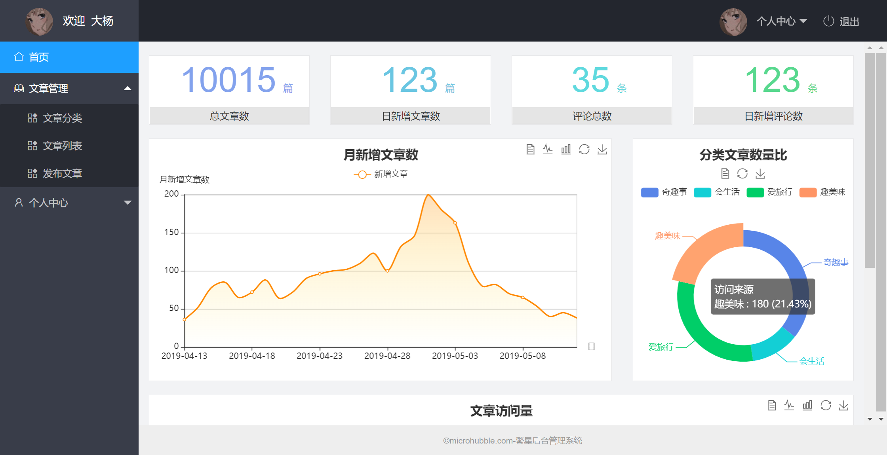
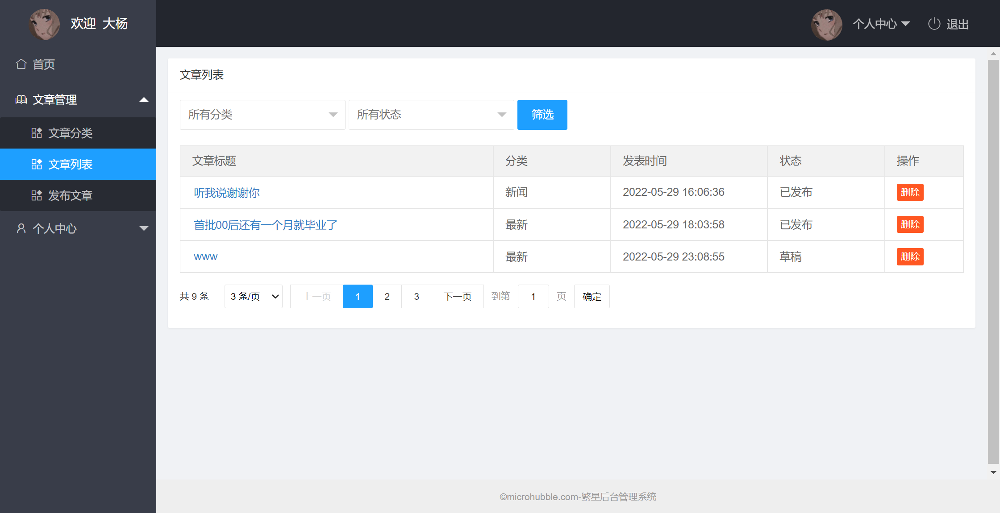
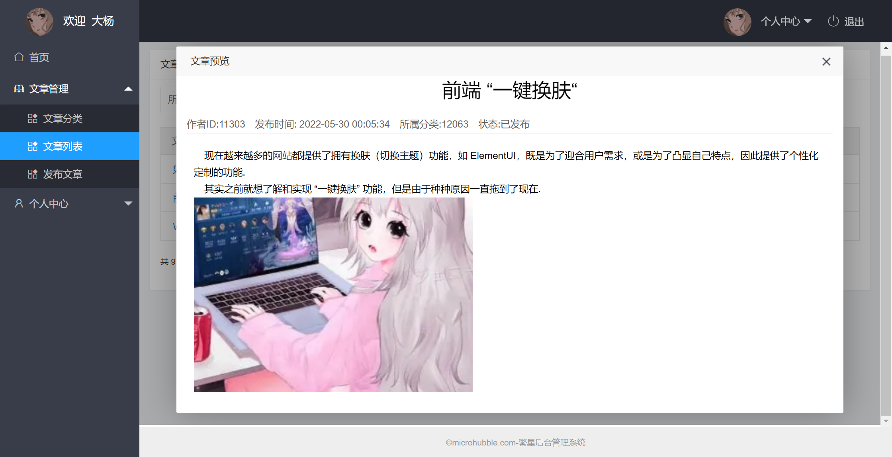
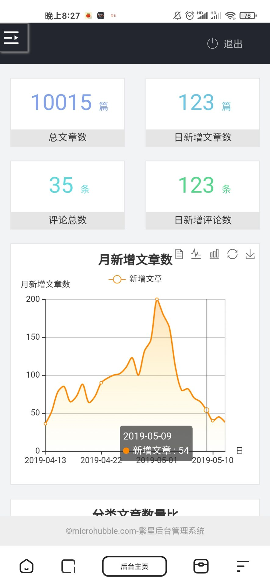
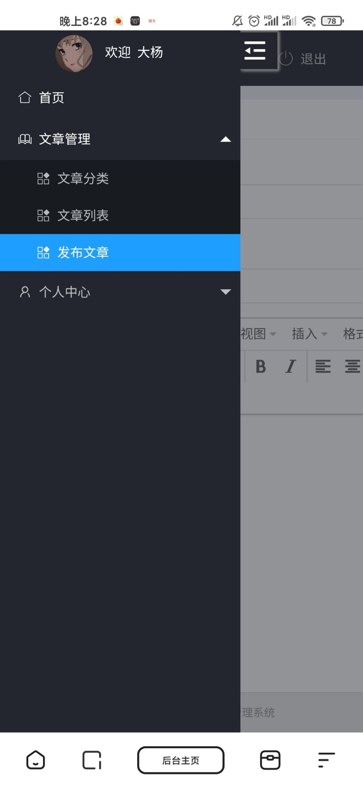
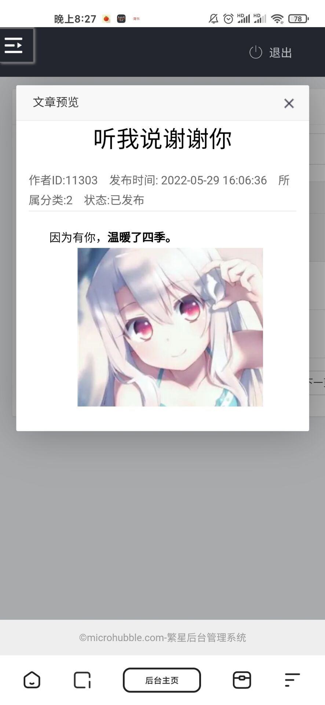

# 基于layui的响应式文章后台管理系统

- 项目预览地址：http://manage.microhubble.com/login.html
  - 账号：yang123
  - 密码：JnL2Yce3x0R
  - 或者自己注册账号~

- 简介：繁星后台管理系统是一款基于layui框架设计的，用于文章（分类）的增删改查，富文本页发布文章，编辑裁剪封面的响应式文章后台管理系统。

## 技术栈

### 前端

框架/库：[layui框架](https://www.layui.site)、[jQuery](https://jquery.com/)

模板引擎：[art-template](http://aui.github.io/art-template/zh-cn/)

数据可视化：[echarts](https://echarts.apache.org/examples/zh/index.html)

富文本：**[tinymce](https://github.com/tinymce/tinymce)**

图片裁剪工具：[cropperjs](https://github.com/fengyuanchen/cropperjs)

### 后端

接口文档：https://www.showdoc.com.cn/escook/3707158761215217

## 界面展示

### PC端

#### 系统登录

#### 后台主页

### 移动端

